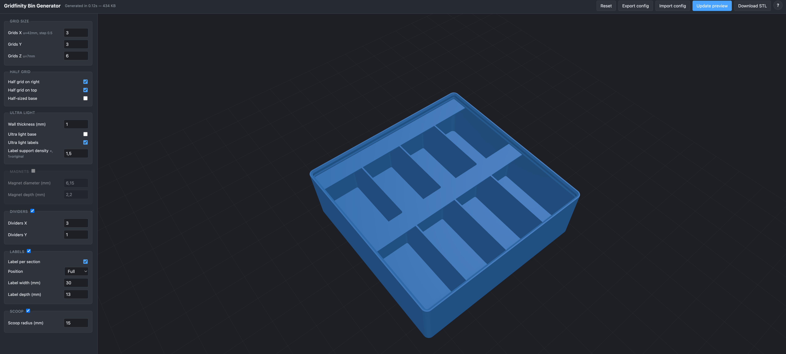

# Gridfinity Bin Generator

Web-based generator for **Ultra Light Gridfinity Bins** — Python port of
HuMa_Meng's [Parametric Gridfinity Ultra Light Bins](https://www.printables.com/model/925520-gridfinity-ultra-light-bin-generator)
SCAD source, with a Flask backend and a live Three.js 3D preview.

OpenSCAD is **not** used at runtime. The CSG runs in pure Python via
[manifold3d](https://github.com/elalish/manifold) (a fast mesh-CSG library);
a full bin generates in ~30–200 ms, fast enough to update the preview as you
edit the form.



## Credits & origin

This is a **derivative work**. All geometry decisions, dimensions, and the
overall design come from the upstream SCAD source by HuMa_Meng. This repo
is a port of that work to the web — nothing more.

* Original SCAD model: **HuMa_Meng**, *Parametric Gridfinity Ultra Light Bins* (CC BY-NC-SA 4.0)
  <https://www.printables.com/model/925520-gridfinity-ultra-light-bin-generator>
* Gridfinity standard: **Zack Freedman** (CC BY 4.0)
* Gridfinity specification (used for verification): **grizzie17** (MIT)
  <https://www.printables.com/model/417152-gridfinity-specification>

If you like the model, support the original author on Printables / MakerWorld.

## License

This project inherits **CC BY-NC-SA 4.0** from the upstream SCAD source — see
[LICENSE](LICENSE). In short: free to share and adapt, attribution required,
**non-commercial only**, derivative works under the same license.

## Install

Python 3.10–3.12 (the build123d regression backend has no wheels on 3.13/3.14):

```bash
python3.12 -m venv venv
./venv/bin/pip install -r requirements.txt
```

## Run

```bash
./venv/bin/python app.py
# open http://127.0.0.1:5050/
```

The left sidebar holds all parameters; right side is the 3D preview. Any
parameter change re-generates the bin after a 150 ms debounce. **Download STL**
saves the current configuration with a descriptive filename like
`gridfinity_3x2x6_w1_hr_ht_ulb_ull_lblFa-30x13_sc15.stl`.

A built-in `?` button in the top bar opens an in-page reference for every
parameter and the filename suffix scheme.

## Browser-only build (experimental)

There's also a fully client-side build under `web/` — same UI, same parameters,
but the geometry is generated in your browser via the WASM build of manifold-3d.
No Python, no server, no cold start.

```bash
python3 -m http.server 5070 --bind 127.0.0.1 -d web
# open http://127.0.0.1:5070/
```

> **⚠️ Experimental.** Compared to the Python build, the WASM manifold engine
> produces a slightly different triangulation (same volume and surface area to
> 4 decimals, ~1.5% more / differently-arranged triangles). The browser build
> is shipped for testing the UI and geometry pipeline; if in doubt, prefer the
> Python (Flask) version, which has more upstream coverage (`compare_geometry.py`
> against build123d, `verify_reference.py` against reference STLs).

The browser build is designed for static hosting (e.g. GitHub Pages) — it has
no backend dependency. WASM and Three.js are loaded from unpkg CDNs.

## Print-verification status

The geometry of both builds passes the dimensional checks below, but the
maintainer **has not yet run physical prints** of any size to confirm
real-world tolerances (foot fit on baseplates, lip stackability, magnet hole
fit, label-tab strength, etc.). If you print something from this generator,
treat the first print as a **calibration** — start with a small bin (1×1×3
or 1×2×3), check baseplate fit and lip stackability before committing to a
large run, and please open an issue if you find tolerance problems.

Geometric checks that do pass (Python build):

* `verify_spec.py` — 24 / 24 dimensional checks against the official Gridfinity
  spec (within 0.001 mm).
* `verify_reference.py` — outer footprint + mutual stackability against the
  Printables 265271 reference STL set, 12 sizes from 1×1×3 to 5×5×12.
* `compare_geometry.py` — Δ volume < 0.4 % vs an independent build123d
  (NURBS / OpenCascade) implementation of the same SCAD source.

## Features

* All parameters from the original SCAD: grid size (incl. half-grid), wall
  thickness, ultra-light base/labels, magnets, dividers, labels (Full / L / C /
  R, per-section), scoops.
* Extra over the original: **label support density** multiplier (controls the
  number of stiffening ribs under ultra-light label tabs).
* Settings persisted in `localStorage` and restored on next visit.
* Export / import of the current configuration as JSON.
* Server-side LRU cache (32 entries) — repeated requests for the same params
  return instantly.

## Files

| File                              | Role                                          |
|-----------------------------------|-----------------------------------------------|
| `gridfinity.py`                   | manifold3d CAD engine (1:1 SCAD port)         |
| `gridfinity_b123.py`              | optional build123d backend — regression only  |
| `app.py`                          | Flask: GET `/`, POST `/generate`, LRU cache   |
| `templates/index.html`            | Form + Three.js viewer + help modal (Flask)   |
| `web/index.html` + `web/gridfinity.js` | Browser-only build (manifold-3d WASM, experimental) |
| `verify_spec.py`                  | Conformance check vs the official Gridfinity spec |
| `verify_reference.py`             | Stackability check vs reference STLs (\*)     |
| `compare_geometry.py`             | manifold3d ↔ build123d regression             |
| `UltraLightGridfinityBins.scad`   | upstream SCAD (kept for side-by-side review)  |
| `LICENSE`                         | CC BY-NC-SA 4.0                               |

(\*) Reference STL set is **not bundled** in this repo to avoid redistributing
files of unclear license. To run `verify_reference.py`, download the ZIP from
[Printables 265271 — Gridfinity Lite Economical Plain Storage Bins](https://www.printables.com/model/265271)
and unpack it into `gridfinity-lite-economical-plain-storage-bins-model_files/`
at the repo root.

## CLI

```bash
./venv/bin/python gridfinity.py /tmp/my_bin.stl
```

Uses defaults (1×2×3, ultra-light, no magnets/dividers/labels/scoop).
For non-default parameters, import `GridfinityParams` and call
`export(p, path)`.

## Architecture notes

The engine is a **literal port** of the SCAD source — no design changes, no
optimisation tricks. Each construct maps directly:

| OpenSCAD                      | manifold3d                                  |
|-------------------------------|---------------------------------------------|
| `cube`, `cylinder`            | `Manifold.cube`, `Manifold.cylinder`        |
| `translate`, `mirror`         | `.translate()`, `.mirror()`                 |
| `union` / `difference`        | `+` / `-`                                   |
| `hull() { 4 cylinders }`      | `Manifold.batch_hull([…])`                  |

If you fix a bug or add a feature, please follow this 1:1 style — find the
equivalent in the SCAD source first, then translate it to the same primitives.

## Contributing

Issues and PRs welcome. By contributing you agree your changes are released
under CC BY-NC-SA 4.0 (the project's license).

Ground rules:

* Do not introduce features that don't exist in the upstream SCAD without
  explicit need — this is a port, not a fork in spirit.
* Run `verify_spec.py` before sending geometry-touching changes (24/24 must
  stay green).
